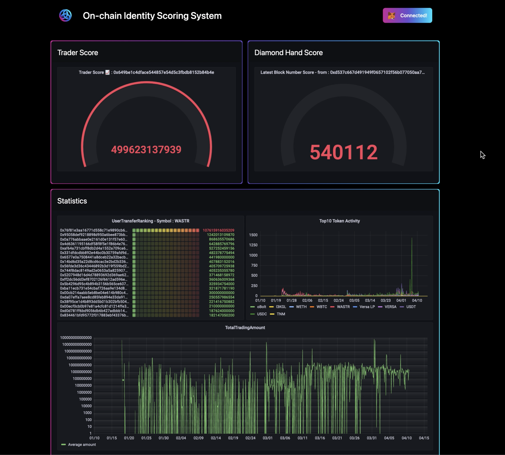
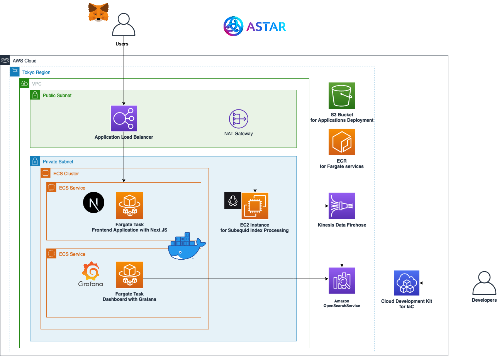

# Integrated Astar Network Observation and Scoring System - IANOS



## Overview

本プロダクトは Astar x Slash Bounty Bootcamp Hackathon に向けて開発された On-chain Identity Scoring System です。
本プロダクトは以下の特徴を持ちます。

* ユーザは MetaMask アカウントを連携し、Astar Network 上でのアクティビティに基づくランキングやスコアを表示するダッシュボードを閲覧できます
* フロントエンドは Next.js および Grafana を利用して開発されており、カスタマイズ可能で表現力に優れたダッシュボード環境を提供します
* スコアリングに用いられるデータは Subsquid indexer および web3.js を利用して収集・蓄積されます
* インフラストラクチャには IaC (Infrastructure as Code) や AWS のマネージドサービスを利用することで運用負荷を軽減し、将来的な機能拡張や利用者の増加、ネットワークの拡大にも対応可能です

## Scoring Systems

本プロダクトでは以下のユーザアクティビティ表示システムを実装しています。

1. `Trader Score`：ユーザが連携したアカウントのウォレットアドレスに基づいて、期間中のユーザーの平均送金額をスコアとして表示します
2. `Last Block Number`: ユーザが連携したアカウントのウォレットアドレスに基づいて、ユーザが関わった最後のブロック番号を表示します

また本プロダクトは更なる機能拡張のサンプルとして、以下のような Astar Network 全体の統計データダッシュボードを実装しています。

1. `Top10 Token Activities`: チェーン全体で最もやりとりされている Top10 のトークンコントラクトへの wei 送信量を表す TimeLine グラフを表示します
2. `Token Based User Ranking`: 特定またはすべてのトークンにおいて、コントラクトへの送信量が最も多いウォレットアドレスをランキング形式で表示します
3. `Total Transfer Sum` : チェーン全体において、特定期間中のトークン送信量の TimeLine グラフを表示します

## Architecture

本プロダクトのアーキテクチャを以下の図に示します。
各コンポーネントの詳細は [Design Considerations](#design-considerations) に記載します。



## Design Considerations

本プロダクトは大きく分けて MetaMask を連携したユーザのスコアリング結果を表示する Frontend と、Subsquid indexer を通してスコアリングに利用するデータを収集する Squid Processor から構成されています。

本プロダクトは IaC ツールである [AWS CDK](https://aws.amazon.com/jp/cdk/) を使用してデプロイできます。
これによって本プロダクトの速やかなプロダクション環境へのデプロイを可能とし、また他のネットワークでの利用や機能追加などに対する高い再利用性、メンテナンス性、そして拡張性を実現しています。

### Frontend

フロントエンドは Fargate 上で動作する Next.js によって提供されます。
ユーザの増減に応じて起動するコンテナ数は自動的にスケールし、将来的なユーザ数の増加にも対応できるように設計されています。

ユーザが閲覧するダッシュボードは同じく Fargate 上で動作する Grafana によって提供されます。
Grafana はインデックスデータが格納されている Amazon OpenSearch Service に接続されており、動的にデータを集計・取得して表示します。
クエリや格納するデータをカスタマイズすることによって多様なダッシュボード・スコアリングアルゴリズムを実装、拡張できます。
Grafana 単体でも本プロダクトの運用者が Astar Network 上のアクティビティの分析基盤としても応用可能です。

### Subsquid Processor

本プロダクトでスコアリングに利用するデータは Subsquid の [Substrate Processor](https://docs.subsquid.io/substrate-indexing/) および web3.js を利用して収集します (以後、Processor と呼称)。
Processor は EC2 インスタンス上で動作し、`approve` や `transfer` といった call イベントをフィルタリングした後に web3.js を利用して取得した補助的な情報を付加し、Amazon Kinesis Data Firehose を経由して Amazon OpenSearch Service にデータを格納します。

現時点では処理対象のトランザクション数が比較的小規模かつ差分も頻繁には発生しないため、Processor は単一のインスタンス上で動作しています。
データ格納先はデータ量の増加にも対応できるよう設計されており、Processor の追加によってネットワークの拡大後も稼働可能です。

## Deployment

### Prerequisites

はじめに、AWS CDK を実行できる環境を用意してください。
これは、以下の条件を満たしている必要があります。

* 必要なソフトウェアがインストールされていること
  * [Node.js](https://nodejs.org/en/download/)
    * v16 以上を推奨
    * `node -v` コマンドで確認できます
  * [AWS CLI](https://docs.aws.amazon.com/ja_jp/cli/latest/userguide/getting-started-install.html)
    * v2 を推奨
    * `aws --version` コマンドで確認できます
  * docker
    * [Docker Desktop](https://docs.docker.com/desktop/install/mac-install/) のインストールを推奨します
* AWS CLI に適切な AWS IAM 権限 (Administrator 相当が必要) が設定されていること
  * IAM ロールの設定をするか、 `aws configure` コマンドで IAM ユーザーの情報を入力してください
  * [こちらのページ](https://docs.aws.amazon.com/ja_jp/cli/latest/userguide/cli-configure-files.html) をご参考にしてください

### Getting Started

はじめに、デプロイ先のリージョン名を `cdk/bin/cdk.ts` の `region` に記入してください。以下は `us-east-1` リージョンにデプロイする場合の記入例です。

```typescript
const env: cdk.Environment = { region: 'us-east-1' };
```

本リポジトリのルートディレクトリ (`README.md` のあるディレクトリです) 直下の `/cdk` に移動し、以下のコマンドを実行してください。

```sh
# Node の依存パッケージをインストールします
npm ci
# ご利用の AWS 環境で CDK を利用できるように初期化を実行します
npx cdk bootstrap
```

`npm ci` は、Node の依存関係をインストールします。初回のみ必要です。

`cdk bootstrap` は、ご利用の環境で CDK を利用できるように初期設定をおこないます。
こちらはある AWS アカウント･あるリージョンで初めて CDK を利用する場合に必要です。2 回目以降は必要ありません。

✅ `Environment aws://xxxx/us-east-1 bootstrapped` という旨が表示されていれば成功です。次の手順に進んでください。

### Grafana コンテナイメージ の作成

最初にダッシュボードの表示に使用する Grafana のコンテナイメージを作成します。
`container/grafana` 以下で以下の作業を順に実行してください。

1. [grafana.ini](./container/grafana/grafana.ini) を開き、`admin_password` を強力なパスワードに変更してください
    * デフォルト値は `admin` です
2. [create_grafana.sh](./container/grafana/create_grafana.sh) を実行します
    * ローカルで Grafana 用コンテナが起動します。

    ```sh
    cd container/grafana
    bash create_grafana.sh
    ```

3. [Grafana](http://localhost:3000) をブラウザで開き、`username: admin`, `password: {ご自身で設定したパスワード}}` で Grafana にログインします
4. [API Key 作成ページ](http://localhost:3000/org/apikeys) を開き、新しい API Key を作成します
    * `Key name` は任意の値、`Role` は Editor、`Time to Live` は適当な値 (e.g. `1y`) を選択してください
5. API Key の値を `bin/cdk.ts` の `grafana_api_key` に記入してください
6. [push_to_ecr.sh](./container/grafana/push_to_ecr.sh) を実行し、API Key 発行済の Image を作成し ECR に Image をプッシュします
    * 引数にはデプロイ先のリージョンを指定します。以下に実行例を記載します

    ```sh
    bash push_to_ecr.sh us-east-1
    ```

以上で Grafana 用コンテナイメージの作成は完了です。

### Deployment Steps

CDK でスタック群をデプロイします。

1. OpenSearch Cluster のデプロイ
    * 以下のコマンドを実行し、OpenSearch Cluster をデプロイします
    * `npx cdk deploy OpenSearchClusterStack`
2. OpenSearch Dashboard へのアクセス権限の設定
    * [こちらのページ](https://aws.amazon.com/jp/premiumsupport/knowledge-center/opensearch-troubleshoot-cloudwatch-logs/) の　*きめ細かなアクセスコントロールが有効になっている場合、CloudWatch ロググループを OpenSearch Service ドメインにストリーミングできない* のセクションを参考に、Delivery Stream にアタッチされた IAM ロールの ARN (`OpenSearchClusterStack` デプロイ後にターミナルに表示されます) に権限を追加してください
3. Subsquid Processor, ECS Cluster のデプロイ
    * 以下のコマンドを実行し、Subsquid Processor と ECS Cluster をデプロイします
    * `npx cdk deploy OnchainScoringSystemStack`
4. Grafana の初期設定
    * Grafanaにログインし、左メニューから `Configuration` をクリックし、`Add data source` を選択します
    * Data source の種類は `OpenSearch` を選択し、`OpenSearchClusterStack` の API エンドポイント URL を入力します。（Data Sourceの名前は変更しないでください。）
    * 同じ設定画面で、`Auth` の設定で `Basic Auth` のトグルを On にします。`Basic Auth Details` の項目が出るので、`User`, `Password` にはそれぞれ Opensearch のユーザ名とパスワードを入力してください
    * さらに下の項目で `Index name` の欄に `astar` を入力します。その後 `Time field Stamp` の中身 `@timestamp` を `timestamp` に変更します
    * 最後に一番下の `Save & test` を押し、"Index OK. Time field name OK" が表示されれば Grafana の Data Source の接続は完了です
    * この時同じ画面でブラウザのURL欄の最後の `/`以降の UID をメモします。(例：`18ysFDbVk`)
    * フロントエンドのソースコード `./container/nextjs/next-app/pages/api/api-body` 以下の `.ts` で data source ブロックの `key:uid` の値をすべて先ほどメモしたものに置き換えます。例：`"uid": "7S_IFIb4z" -> "uid": "18ysFDbVk"`
    * 以上で Grafana の設定は完了です
5. ブラウザでのアクセス
    * `FrontendServiceStack` のデプロイ後、コンソールにフロントエンドのアクセス先が出力されます
    * 例: `OnchainScoringSystemStack.Web2ClusterNextjsServiceServiceURLXXXXXXXX = http://Oncha-Web2C-XXXXXXXXXXXXX-1234567890.us-east-1.elb.amazonaws.com`

### Clean up

リソースを削除する際は、以下の CDK コマンドを実行してください:

```sh
npx cdk destroy --all
```

* `create_grafana.sh` で作成した Grafana コンテナイメージを[マネジメントコンソール](https://console.aws.amazon.com/ecr/repositories) から削除してください

## FAQ

Q1: ライブデモで自身のアドレスを連携してもその結果が反映されないのはなぜですか？

A1: 今回、既に Astar Network 上でアクティビティがあるアカウントを事前に設定し、そのアカウントに関する情報を表示しています。このような実装を行った背景として、より多くの方にこのアプリケーションを体験していただきたいという考えがあります。本番利用の際には連携したアカウントの情報を表示する必要がありますが、実装を少し変えるだけで上記の設定は可能です。

Q2: 本サービスは AWS 以外のインフラストラクチャ上で動作しますか？

A2: デプロイの簡略化、運用負荷の低減のため AWS 上に構築しておりますが、コンテナをベースとし OSS を利用してアプリケーションを構築しているため AWS 以外のインフラストラクチャへの移植も可能です。

## Related Contents

* [AKINDO On-chain Identity Scoring System](https://app.akindo.io/hackathons/mV8ExzgLGSlo8Zvd)
* [Astar×Slash Bounty Bootcamp Hackathon🧑🏻‍💻](https://akindo.notion.site/Astar-Slash-Bounty-Bootcamp-Hackathon-7133ffb059624bbd9d2ba079058ad1fc)
* [subsquid](https://docs.subsquid.io/)
* [squid-astar-example](https://github.com/subsquid/squid-astar-example)
